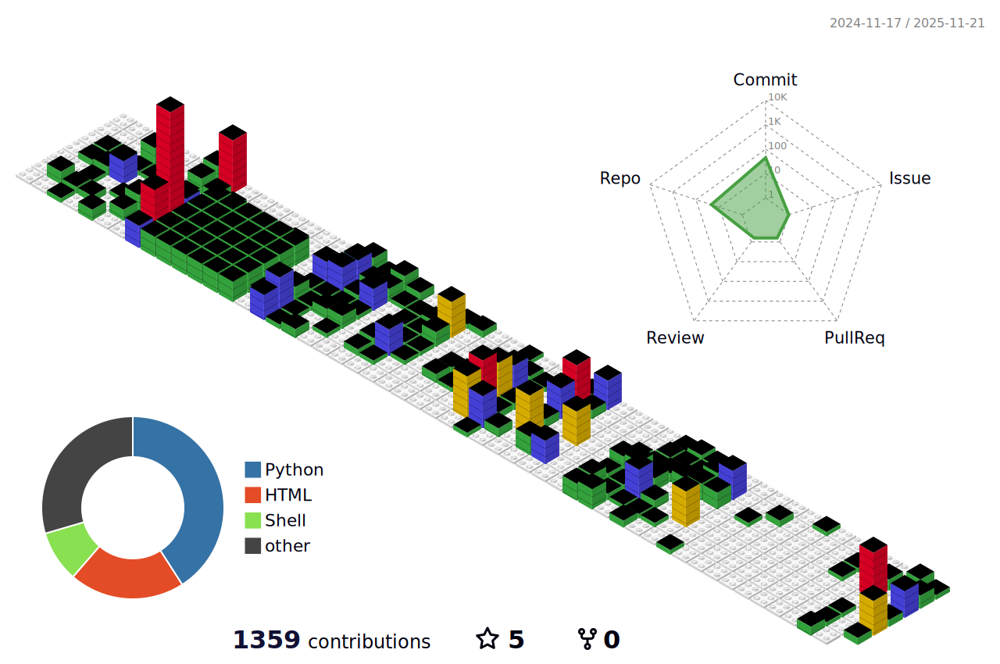
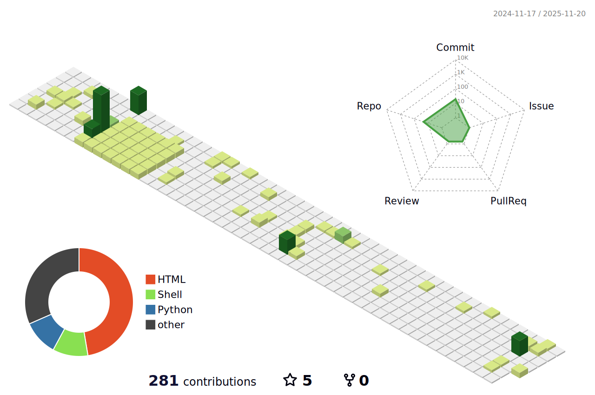
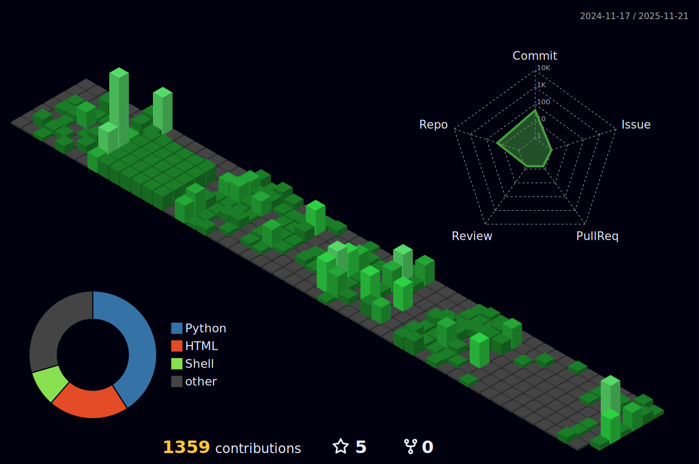
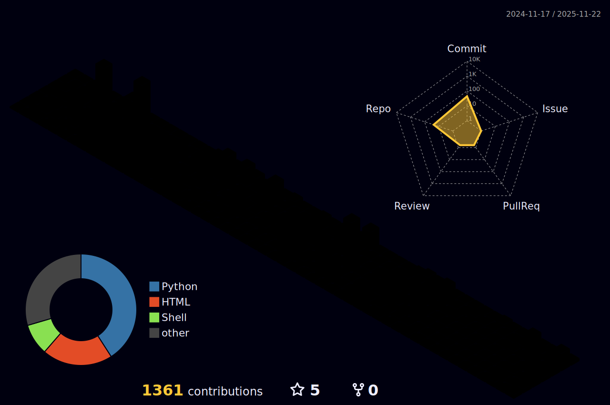
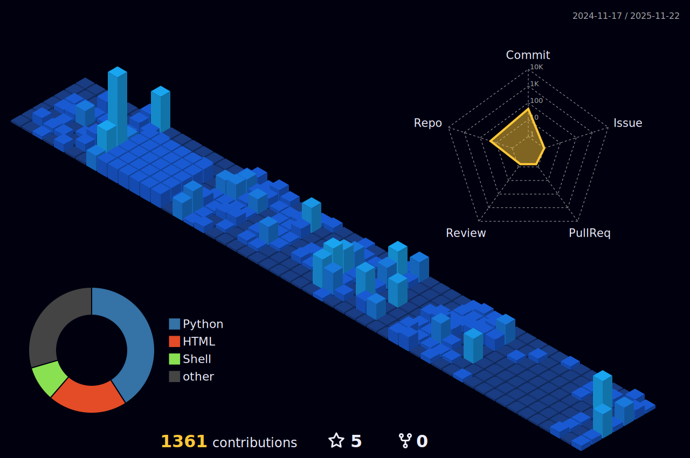
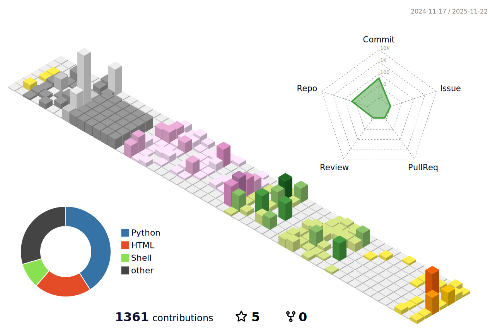
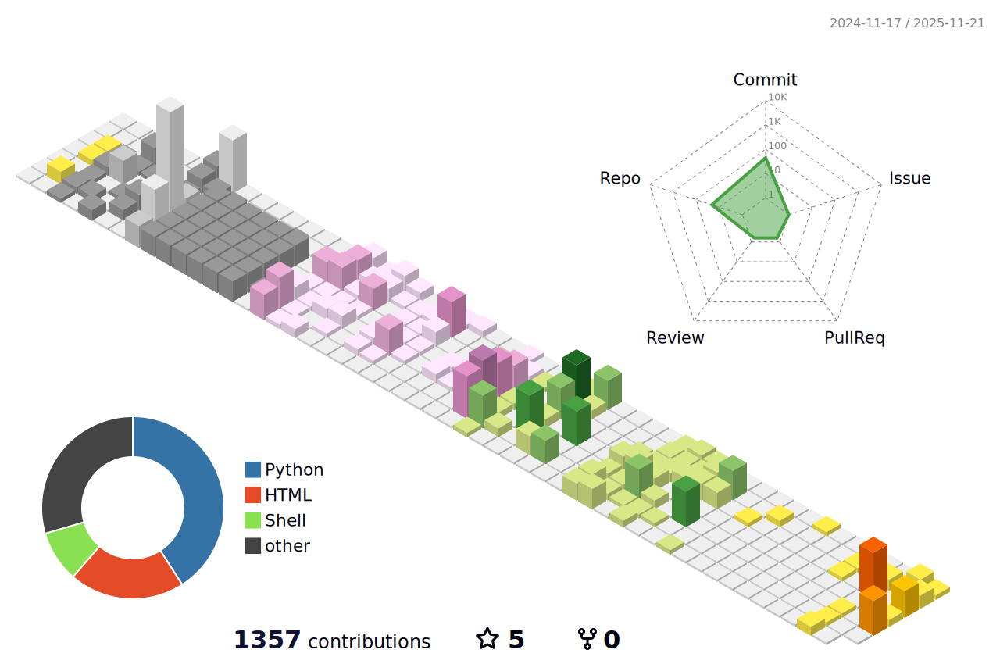
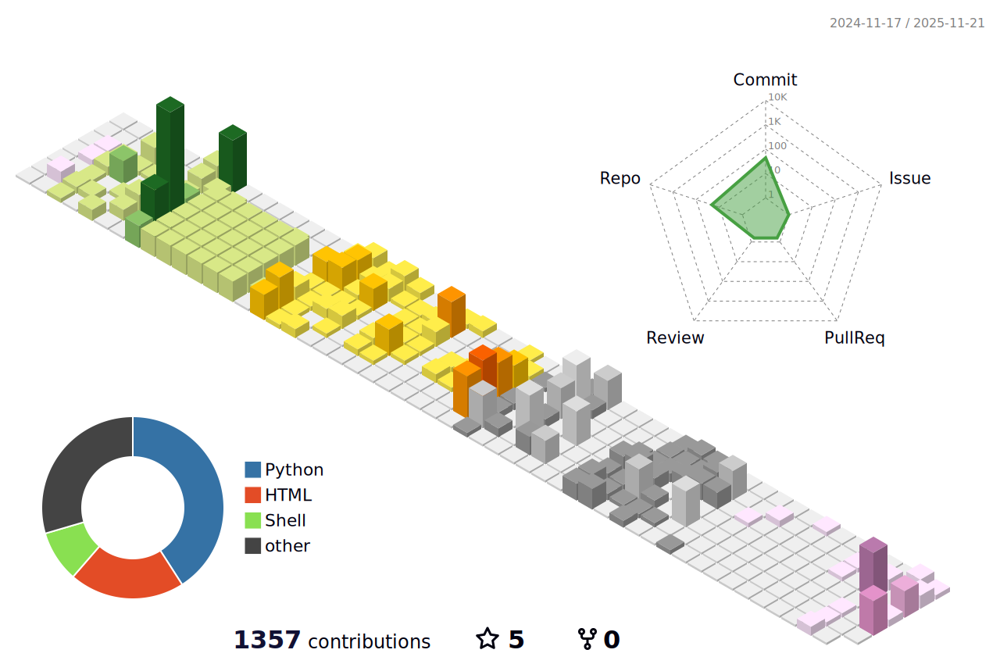

# 👋 Hello, World!  

欢迎来到我的 GitHub 主页，这里展示了我的贡献图和活动图。

---

## 🎨 我的 3D 贡献图合集

| Gitblock |
|----------|
|  |

| Green Animate | Green |
|---------------|-------|
|  |  |

| Night Green | Night Rainbow | Night View |
|-------------|---------------|------------|
|  |  |  |

| Season Animate | Season | South Season Animate | South Season |
|----------------|--------|----------------------|--------------|
|  |  |  |  |

---

## 📈 我的活动图

---

## 🏆 我的 GitHub Stats

  

---

## ✨ 关于我

- 🔭 正在探索更多开源项目，感谢 GitHub 平台带来的学习与交流机会  
- 🌱 学习与实践 **AI、Vibe Coding、SRE、CI/CD**  
- 📝 我的博客：[blog.at9.net](https://blog.at9.net)  
- 🌐 个人主页：[at9.net](https://at9.net)  
- 🚀 我的社区平台：[cnb.cool/htazq](https://cnb.cool/htazq)  

---
